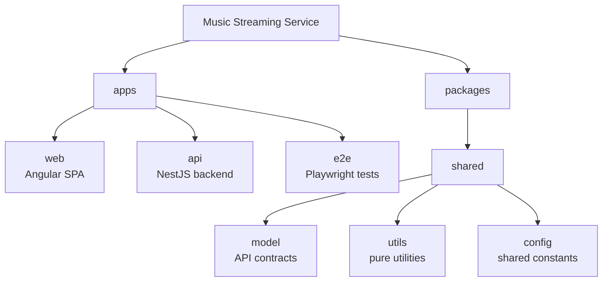

# Pupufy

[](https://nx.dev/) [](https://angular.dev/) [](https://rxjs.dev/) [](https://nestjs.com/) [](https://www.typescriptlang.org/) [](https://www.postgresql.org/) [](https://www.prisma.io/) [](https://www.docker.com/) [](https://playwright.dev/) [](https://zod.dev/) [](https://swagger.io/) [](https://pnpm.io/)

## Overview

The Pupufy application is an implementation of [Jamendo API](https://developer.jamendo.com/v3.0/docs). It allows free access to stream and download more than 350,000 songs from the Jamendo catalog - all published under Creative Commons licences - without advertisements. With Jamendo's featured selections, the user can easily discover and listen to albums, songs and the most popular artists.

### Deployment

[Application deployment](https://pupufy.tryproxy.online/)

### Team

| Name                 | Github                                      |
| -------------------- | ------------------------------------------- |
| Anastasia Savrukhina | [savryna](https://github.com/savryna)       |
| Nikita Melnikov      | [tryproxy](https://github.com/tryproxy)     |
| Vsevolod Timoshenko  | [shoblinsky](https://github.com/shoblinsky) |
| Hanna Surmach        | [khasekai](https://github.com/khasekai)     |

## Workspace

Nx monorepo with:

- `apps/web` (`~/*`) - Angular SPA
- `apps/api` (`$/*`) - NestJS backend
- `apps/e2e` (`#/*`) - Playwright end-to-end tests
- `packages/shared/model` (`@streaming-service/model`) - shared public API contracts
- `packages/shared/utils` (`@streaming-service/utils`) - shared pure utilities
- `packages/shared/config` (`@streaming-service/config`) - shared constants/config

More structure notes: [docs/architecture.md](./docs/architecture.md)

### Quick Start

Install dependencies, start the local database, then run the app:

```bash
pnpm deps
pnpm db:up
pnpm dev
```

Stop Docker Compose services when finished:

```bash
pnpm dev:down
```

### Common Checks

```bash
pnpm lint
pnpm typecheck
```

Install Playwright browsers once before local e2e runs, then run e2e tests:

```bash
pnpm exec playwright install
pnpm test:e2e
```

All package scripts and descriptions are listed in [docs/scripts.md](./docs/scripts.md).

### Top Level Structure



### Generate

Generator examples are documented in [docs/generators.md](./docs/generators.md).

### Meeting Notes

Regular team syncs were conducted during the project.

- [Team Sync](https://docs.google.com/document/d/1FJNDPLdOQbJG7UnyvCVwCOvd43HrvQtS86Qxx85Qp84/edit?tab=t.i7fg7ool7utd)
- [Team Sync](https://docs.google.com/document/d/1FJNDPLdOQbJG7UnyvCVwCOvd43HrvQtS86Qxx85Qp84/edit?tab=t.0)

### Demo Video

A short video demonstrating the main application states:

- Loading
- Error
- 404 Not Found

[demo link](https://drive.google.com/file/d/1en3UHuFfAASPKeAPOEAQIzNm4zw_EoTk/view?usp=sharing)
