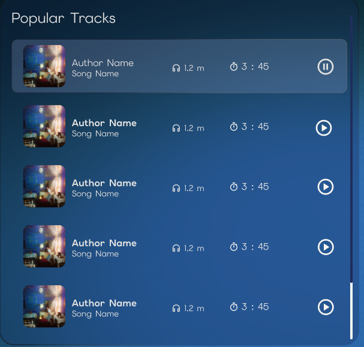
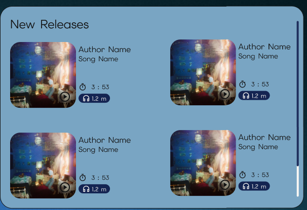

## Sprint 1 : Project Setup & Component Basics

Дата: 17.05.2026

**Что было сделано:**

В этом спринте я добавила переиспользуемый компонент трека и подготовила данные для отображения компонента.
Подробнее разобралась с данными API Jamendo и с нужными мне endpoints. Создала интерфейсы и моковые данные для нужных endpoints:

- `/v3.0/artists/tracks`
- `/v3.0/playlists/tracks`
- `/v3.0/tracks`

Также добавила два `pipes`. Первый `pipe` простой переводит время из секунд в формат минуты:секунды. Второй `pipe` переводит числа в короткий формат (1_200_000 --> 1.2M).

**Проблема-1:**

Разное визуальное отображение элемента `track` на страницах приложения.

Макет для приложения создавала я и из-за критически малого опыта в создании макетов произошел косяк с разным отображением компонентов.

**Решение:**
Я сделала два отдельных компонента под разные отображения.

- `track-card`
- `track-row`

Они импортируются в компонент `track`, который будет получать извне значение `view` и в зависимости от этого добавлять один из дочерних компонентов.

На общем созвоне решили, что этот косяк можем превратить в фишку приложения с переключением отображения списка треков. Будет два состояния список строчный и список как грид-область.

Также в компонент добавила emit события, который по моей задумке при клике на кнопку play, будет отдавать наверх данные о треке, чтобы в playWidget попал нужный трек. Но пока это невозможно протестировать, без нужных компонентов.

**Что выучила:**

- input() сигнал
- output() сигнал
- условный рендеринг с @if @else

**Проблема-2:**

Разные интерфейсы для одной сущности в разных endpoints.

Интерфейсы, которые получились для `/v3.0/artists/tracks` и `/v3.0/tracks` отличилась количеством ключей, а некоторые значения были избыточны для моего компонента.

**Решение:**

Я познакомилась с принципом ✨Two-Tier Data Model архитектура✨. Смысл в том, что бы разделять DTO модель и UI (runtime) модель данных.
Мне не хотелось держать несколько интерфейсов (избыточных) для одного компонента track. Плюс я понимала, что есть поля, которые мне нужны, но в модель от API их нет.
Я создала отдельную UI-модель, которая формируется на основе DTO-моделей и содержит только поля, необходимые компоненту.
**Что выучила:**

- поверхностно познакомилась с некоторыми принципами чистой архитектуры
- пополнила список областей в которых я полный ноль

**Проблема-3:**

Ангуляр еще не добавили ChangeDetection.OnPush стратегию как дефолтную.(╯°□°）╯︵ ┻━┻)
Я ошибочно думала, что с ангуляр 20 ChangeDetection.OnPush это дефолтное состояние для созданных компонентов.

**Решение:**
После долгих обсуждений, поиска информации в разных источниках, даже документации (спойлер: информации там не было) мы пришли к выводу, что нужно вернуть правило eslint запрещающее использовать любую стратегию отличную от onpush и сразу настроили конфиг shematics для автоматического добавления параметра к созданным компонентам.

**Что выучила:**

- стратегия onpush станет дефолтной только в 22 версии ангуляра :)

**Проблема-4**

В ангуляре не оказалось готового pipe для перевода чисел в короткий формат.

**Решение:**

В JS есть встроенный объект Intl.NumberFormat, который делает то же самое.
Но не хотелось усложнять логику компонентов.
Пришлось делать свой pipe.

**Что изучила**

- изучила все встроенные pipe, которые есть в ангулярe
- узнала об Intl.NumberFormat в JS

**План на sprint 2**

- доработать недостающий дизайн для макета (страница о нас, 404)
- добавить header component
- добавить страницу 404
- добавить artist page без логики, если не будет стора
- осваивать библиотеку rxjs

**Затраченное время:**

10-12 часов
