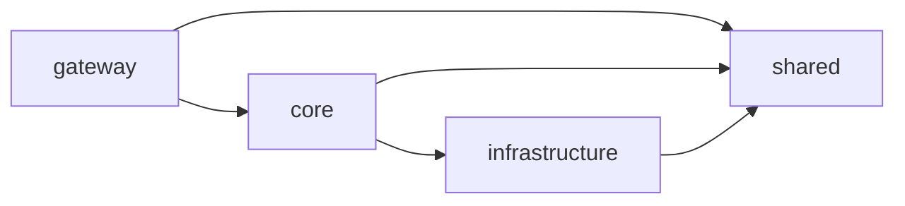

# Sprint 2: Routing & Signals (@angular/router, @angular/core) — 2026-05-28

## What was done & Problems:

### 1. Docker, Docker Compose, CI

Добавил докер образы, настроил докер-композ и ci, теперь гитхаб загружает образы фронта и бэка в GHCR(GitHub Container Registry) - специльное хранилище для образов, включая докер-образы, из которого, имея личный токен, можно их скачать, если репо приватное.

Теперь чтобы задеплоить на ВПС мне пока нужно скачать образы и запустить докер-композ на сервере самому, так что CD пока еще не настроено доконца.

### 2. Зачем у бэкенда два stage в Dockerfil

Долго не мог понять зачем нужно 2 стэйджа в докер файле для бэкенда. Оказалось что так можно уменьшить размер финального образа.

Первый stage:

- устанавливает все зависимости
- билдит приложение
- кладет сборку в `/dist`

По сути, он только готовит артефакты сборки.

Второй stage:

- устанавливает только runtime-зависимости
- копирует готовую сборку через `COPY --from=build`
- запускает приложение `node /app/main.js`

В результате финальный образ получается заметно легче: без dev-зависимостей.

Наверно, это первый раз, когда я на себе почувствовал, зачем делить зависимости на dev и production, потому что раньше в чем это выглядело как формальность.

### 3. Архитектура своего бэка и NestJS

Еще я натягивал сову на глобус, пытаясь уложить нестджс на кастомную fullstack-архитектуру, с которой мне посчастливилось повозиться не так давно, получилось неплохо, удалось более-менее разделить транспортный слой от бизнес логики. У меня получилось 4 слоя: gateway, core, infrastructure, shared.

#### Поток зависимостей получился такой:



#### Слои:

- `gateway` — inbound-адаптеры. Слой входа в бэкенд: контроллеры и обработчики запросов. Здесь находится все, через что с системой можно взаимодействовать извне: REST, GraphQL, static HTML, bots.

- `core` — бизнес-логика. Здесь лежат NestJS-сервисы, `workflows` и `steps`.
  - `Workflow` — бизнес-сценарий, собранный из нескольких шагов.
  - `Step` — атомарное бизнес-действие внутри `Workflow`, которое можно переиспользовать в разных сценариях. Например, `issue-auth-session.step` может быть последним шагом и в `login-user.workflow`, и в `register-user.workflow`.

  Пример `login-user.workflow`:

  ```mermaid
  graph LR
    subgraph W[login-user.workflow]
      A[find-user-for-login.step] --> B[verify-login-password.step]
      B --> C[issue-auth-session.step]
    end
  ```

- `infrastructure` — outbound-адаптеры. Слой интеграции с внешними системами: база данных, внешние API, файловые хранилища и другие технические зависимости. Например: `PrismaClient`, `apiClient` для Jamendo.

- `shared` — общий код, который переиспользуется между слоями: утилиты, конфигурации.

#### Всратый нэйминг

Захотелось как-то усложнить себе жизнь и добавить ограничения в именовании типов, чтобы видеть четкое разделение. Зачем, сам не знаю.

Зафиксировал такой подход к именованию типов:

- `Request` / `Response` — только для HTTP-контрактов.

  ```ts
  register(data: RegisterRequest): Promise<AuthTokenResponse>
  ```

- `Dto` — для валидации и transport-слоя, например в `auth.controller`.

  ```ts
  register(@Body() dto: RegisterDto)
  ```

- `Command` / `Query` — чтобы показать намерение для воркфлоу.

  ```ts
  execute(command: RegisterUserCommand)
  execute(query: GetCurrentUserQuery)
  ```

- `Input` / `Result` — для шагов.

  ```ts
  execute(input: CreateUserAccountInput): Promise<CreateUserAccountResult>
  ```

- `Entity` / `Model` / `Record` — для разных форм представления данных внутри системы:
  `Record` только для чистых БД-типов, `Model` для внутренних типов вроде `AuthUser`, `Entity` — для доменных сущностей вроде `Track` или `User`.

  ```ts
  type User = ...
  type AuthUser = ...
  type UserRecord = ...
  ```

## Summary:

Хоть мне и понравилось возиться с бэкендом, иногда складывалось ощущение, что я занимаюсь немного не тем, (не ангулряром).

## Plans for the next week:

Заложить схему БД для всего приложения, переложить типы Jamendo, донастроить CD, создать форму авторизации и регистрации, изучить ангуляр подходы, написать страница Discovery.
